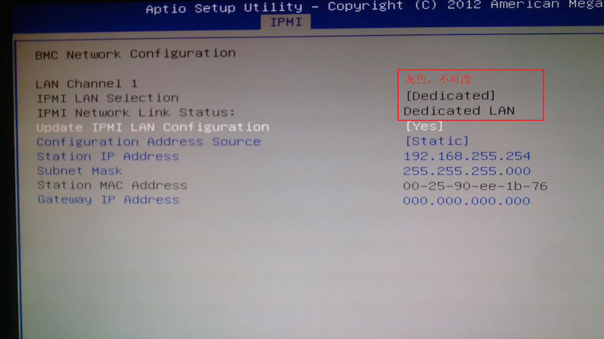
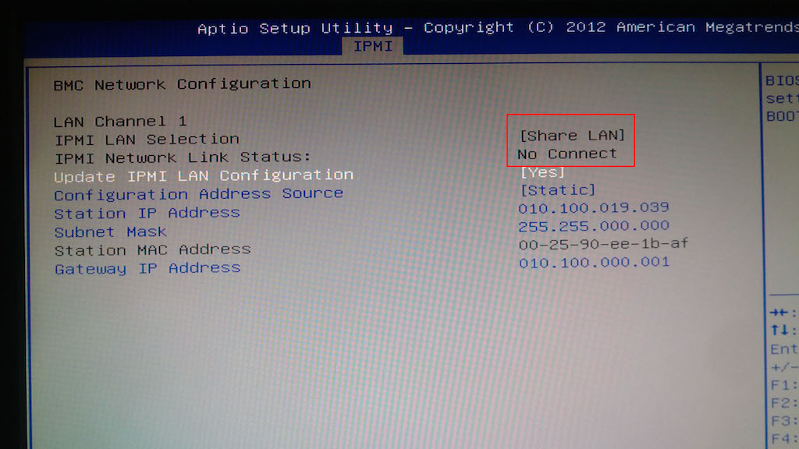
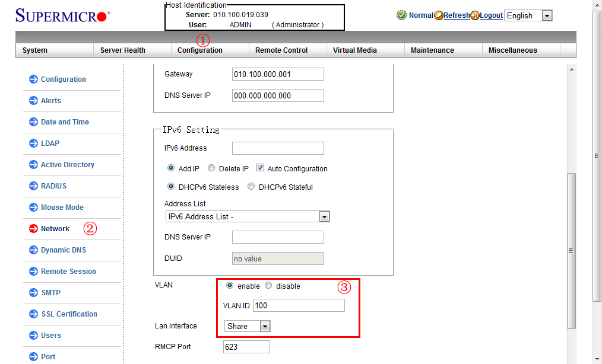

IPMI allows system administrators to control server hardware remotely, no matter what state the operating system is in — even when the machine is powered off, as long as the power supply is connected. This makes IPMI extremely valuable for servers used in experiments. Our cluster had always used a dedicated IPMI network, which required extra switches and cables, extra installation and maintenance work, and made the wiring messy and hard to manage.

For our newly deployed cluster, we planned to use IPMI over the shared port and cabling. The basic principle is to multiplex the eth0 port through VLANs: the production network and the IPMI network run in separate VLANs. When a packet arrives at the eth0 port, its VLAN ID is checked first; if it matches the IPMI VLAN ID, the packet is forwarded to the IPMI subsystem, otherwise it goes through the normal packet processing path.

When I eagerly entered the BIOS to configure the IPMI network, I found that I could only change the IP address, subnet mask, and gateway — the network port option was stuck on "dedicated" and grayed out. As shown below:

I suspected the "IPMI LAN Selection" option was locked because the motherboard integrated a relatively new 10GbE NIC whose IPMI features were not yet complete, so I gave up for the moment. However, while searching for information online that evening, I stumbled upon the fact that this NIC supports "IPMI passthrough" — judging from the name, the related functionality seemed to be complete, so I decided to give it another try.

This time, I first set a static IP address, subnet mask, and gateway for IPMI in the BIOS, then connected to the network through the dedicated IPMI port and opened the IPMI web configuration interface in a browser. On the Configuration / Networking page, I found the shared-port settings, as shown below. I set VLAN to "enable", VLAN ID to "100", and Lan Interface to "Share" — and then successfully accessed IPMI through the eth0 port on VLAN 100.

After configuring the shared port, entering the BIOS again showed that the IPMI network port had changed to "Share LAN", while the dedicated network connection status became "No Connect".

