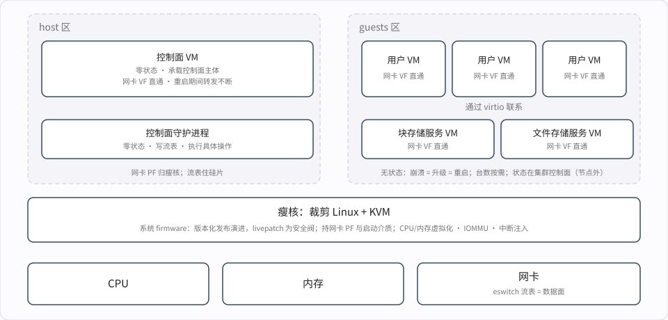

## 一、被瓜分的遗产

### 1.1 二十年前的许诺

升级虚拟化栈是云运维最古老的痛：数据面
和设备模型住在宿主内核与用户态里，而宿主
始终无法回答一个问题——固件与软件的边界
到底划在哪？今天的宿主里几乎一切都是软件，
于是几乎每一次升级都只能是机器级事件：
升级内核意味着重启宿主，而重启随之带来
迁移与维护窗口。

2005 年，Xen 团队在 HotOS 上发表了一篇
标题即问句的论文：
[Are Virtual Machine Monitors Microkernels Done Right?](https://www.usenix.org/event/hotos05/final_papers/full_papers/hand/hand.pdf)
问句的标尺是微内核的毕生追求：极小特权层、
服务放进隔离的域、故障域彼此独立。问句问
的是：VMM 是不是把这三条终于做成的那个
载体？若这三条做成，服务栈就不再与宿主
共命运——开篇之问便有了架构上的答案。

论文的回答是"是"，论据是一条必要性判断：
VMM 的职责里必须驻在最高特权层的，天然
只有极小一块——CPU/内存虚拟化与隔离本身；
guest 间的边界本由硬件强制；设备驱动、
设备模型、控制面则都不必住在特权层，
原则上皆可推进普通域里运行。

但这个"是"只兑现到形状为止。隔离那一半
天然成立；另一半——住进普通域的服务该像
普通进程一样可重启、可升级——论文自己的
Xen 是最早尝试兑现的。VEE'08 的
[Improving Xen Security through Disaggregation](https://www.cl.cam.ac.uk/research/srg/netos/papers/2008-murray2008improving.pdf)
开出驱动域路线，SOSP'11 的
[Breaking Up is Hard to Do](https://dl.acm.org/doi/pdf/10.1145/2043556.2043575)
（Xoar）把 dom0 拆成一组最小权限的服务域，
每个 guest 的设备模型单独跑在 stubdom 里，
从论文看，架构闭环已经完成。

但部署史回答了另一个词。驱动域和 stubdom
进了主线，却从未进过生产云：Citrix 的
[Windsor](https://www.slideshare.net/slideshow/windsor-domain-0-disaggregation-for-xenserver-and-xcp/14123110)
想做这套拆分，无疾而终；死结在 xenstore
——这个全局注册表始终焊在 dom0 里，每个
guest 的设备树、配置、凭据都挂在它上面，
重启它就要重建整机 guest 的控制面；于是
dom0 重启在运维上等价于宿主重启。纯软件
在云规模的兑现，至今悬置。

于是服务栈的升级没有免费选项：住在用户态
的原地重启，代价是租户承受一次卡顿；住在
内核里的只能随宿主重启——租户迁移或停机。
开篇所说的迁移与维护窗口，正由此而来。
这次失败说明的不是
架构错了，而是架构没能扛住生产。为什么
扛不住——第二章的四层难点就是答案。

### 1.2 业界的实际回答

云厂商用十五年各自作答，但回答的不是
同一个问题。

**AWS：把 dom0 搬进硬件。** 先逃离 Xen，
换上极简的 KVM 系 VMM，再把基础
设施栈整体搬上
[Nitro 卡](https://www.theregister.com/off-prem/2017/11/29/amazon-reveals-nitro-custom-asics-and-boxes-that-do-grunt-work-so-ec2-hosts-can-just-run-instances/802491)。
许诺里"可隔离、可重启的服务域"兑现了——
只是载体从进程域换成了 PCIe 对端。架构
是对的，placement 换成了硅。

**微软：数据面下沉，控制面留下。** 从早期的
[Catapult](https://www.microsoft.com/en-us/research/project/project-catapult/)
FPGA SmartNIC 到
[AccelNet](https://learn.microsoft.com/en-us/azure/virtual-network/accelerated-networking-overview)：
网络策略放进 FPGA 和网卡硅片，宿主软件
只做控制面。这是一半的微内核方案：数据面
有了独立生命，服务栈没有。

**Google：先在软件里跑了十年。**
[Andromeda](https://www.usenix.org/conference/nsdi18/presentation/dalton)
的 VFP——驻在宿主内核的包处理引擎——证明
软件数据面足以承载超大云的 VPC：数据面
不必天生在硅里。但最后，Google 也与 Intel
合研了
[IPU](https://www.reuters.com/technology/intel-google-cloud-launch-new-chip-improve-data-center-performance-2022-10-11/)——
软件路线最坚定的标杆，最终把网络与块
存储的数据面都搬离了宿主——这层卸载硅
Google 对外称
[Titanium](https://cloud.google.com/blog/products/compute/titanium-underpins-googles-workload-optimized-infrastructure)。

**KVM 生态：渐进式剥离，而非结构性拆分。**
vhost 把数据面搬离 QEMU 的设备模型，落脚
内核；
[vhost-user](https://www.qemu.org/docs/master/interop/vhost-user.html)
把它搬进独立的用户态 daemon，可单独重启；
vDPA 再把它卸给硬件。落脚点三次变换，
方向始终如一：QEMU 的设备模型被一点点
掏空。microVM 一派
（[Firecracker](https://www.usenix.org/conference/nsdi20/presentation/agache)、
Cloud Hypervisor、rust-vmm）把 VMM 本体
裁到最小、用 Rust 重写——但裁的是 VMM，
不是服务栈：存储、网络、控制面仍与宿主
共命运。隔离赢了，可重启没有。

四个回答，答的是隔离、数据面、攻击面；
唯一碰到重启性的 AWS，把答案锁进了不外卖
的硅里。纯软件里，没有一个回答原始问题：
**固件/软件的边界能不能划得足够薄——固件
层之上的一切，能否原地升级与重启？**

回头看，许诺被瓜分兑现了：隔离给了
microVM——Firecracker 赢下 serverless；
数据面给了硅片——eswitch 流表与各类卸载
引擎，普通网卡里也有；真正把 DPU 与普通
网卡区分开的卡上通用算力，接走了最后一
块：纪律。唯独最朴素的"服务栈可无痛
重启"，在纯软件里没有归宿。

这正是[上一篇文章](/p/end-of-dpu-myth/)
审计 DPU 后留下的最实质的残值：一个可
独立升级和重启的 root 计算域——工程纪律
用硬件形式固化，而硬件的代价太高。本文
问的是另一半：**同样的边界，纯软件守得住
吗？**

答案是守得住。而且思想的所有零件都已是
各家的现役装备——缺的只是有人把它们
组装成那台机器。

## 二、四重引力

许诺在纯软件里的兑现悬置了二十年，不是
因为没人想到。难处在四层，像四重引力，
合力把架构拉回单体：前三层是工程问题，
最后一层是组织问题。

**机制在，编排缺。** 重启语义从不缺席：
PV（半虚拟化）前后端协议——guest 前端
与服务域后端以共享内存 ring 通信——状态机
留着 reconnect 的出口；vhost-user 把
reconnect 做成了显式特性；热迁移每天都在
做存在性证明——
guest 迁到另一台机器，就在那台机器的
dom0 里重建了全部后端连接。"换掉 dom0"
不需要任何新机制，只需要把 guest、后端、
注册表之间的整张关系网按依赖序拆开、
再按依赖序重建。难在这张网：xenstore
是枢纽，后端互相依赖，拆解与重建的顺序
本身就是问题。没有任何生态把这一步做成了
产品。

**自举循环。** dom0 持有自己 rootfs 所在
设备的驱动。要重启它，得先把硬件所有权
交出去——存储、网络、控制台；而接手这些
所有权的域，自己又要由 dom0 启动和管理。
驱动域化是自举的前提，自举又是驱动域的
安放处。Xoar 拆掉了服务的一侧，自举的
一侧原地未动。

**性能的引力。** 每多一层域边界，就多一次
通知与拷贝。工程优化的引力永远指向把
数据面收回来：收回内核态、收回同进程、
收回同一块硅。vhost 是一次收回，SR-IOV
是更大的一次。隔离与性能在每一代硬件上
重新谈判，而性能几乎总是赢——所以光
"守住边界"不够，守边界的代价必须小到
性能没有叛逃的动机。

**组织的不对称。** 拆除 dom0 的收益弥散给
未来所有升级——每一次升级都从舰队维护
窗口变成一次后台操作；风险却集中在提出者
这一次的故障率上。没有哪个发布经理愿意
为"明年的运维更顺"承担今年的事故。
前三层难在有技术解，第四层没有——它只能
靠设计吸收：把组装的代价降到足够低，把
每次重启的爆炸半径降到足够小。

## 三、组装那台机器

目标只有一个：**把固件/软件的边界划到最薄
——瘦核是系统的 firmware，等价于自研 DPU
里硬化的逻辑，不属于软件、不作热升级的
对象，以版本化发布演进；固件层之上的一切
——服务栈与控制面——可以在任意时刻升级与
重启，不重启宿主、不迁移。**

由此推出两条纪律：

- **核心是固件，不是软件。** 瘦核等价于自研
  DPU 里硬化的逻辑：不作热升级的对象，以
  版本化发布演进，年级别的罕见事件；发布
  之间的 CVE 由 livepatch 作为安全阀吸收。
  它只拥有严格属于它的东西——越小，发布
  越少。
- **服务域必须无状态。** 状态在哪里，
  重启就死在哪里——所以状态一律外置，
  不能丢的东西一律不放进服务域。

### 3.1 架构：三层

架构共三层，如下图：最下是横跨整节点的
瘦核——裁剪的 Linux + KVM，只持 CPU/内存
虚拟化、IOMMU、中断注入与启动介质；其上
并列两区——host 区住控制面：一个特殊 VM
承载主体，瘦核用户态的零状态守护进程执行
操作、写入流表；guests 区住按职能拆分的
服务 VM 与它们服务的用户 VM。所有 VM 各得
一条直通 VF 供自身通信；租户数据面经 VF
直通，不经过任何服务 VM；缓存按分区划，
宿主服务与租户各居其区。以下逐段展开。

**瘦核。** 裁剪过的 Linux + KVM，只管
CPU/内存虚拟化、IOMMU、中断注入与启动
介质——没有数据面、没有控制面。这一层是
本系统的 firmware：等价于自研 DPU 里硬化
的逻辑，以版本化发布演进；KVM 本身就是
内核模块，正落在 livepatch 的射程之内——
攻击面越小，CVE 越少、发布越少，发布之间
漏网的由 livepatch 作为安全阀吸收。瘦核里
不该有什么，比该有什么更清楚：没有存储
驱动、没有设备模型、没有工具栈；网络侧
只留 PF 驱动——eswitch 的管理交给控制面
守护进程。

**无状态控制面：host 侧的一个特殊 VM。**
注册表、配置、编排状态一律外置——唯一
存放处是集群层面的控制面；节点内的控制面
VM 承载控制面主体，零状态，被动接收集群
的调度安排，只下发意图——落地是控制面
守护进程的事，二者各自可重启。控制面 VM
的重启同样转发不断——数据面住在 eswitch
流表里，与它无关。xenstore 的教训在前：
全局注册表不能再焊进任何需要重启的
东西里。

**控制面守护进程。** 网卡的 PF 与其驱动归
瘦核；控制面 VM 下发的实际控制操作——
创建 VM、删除 VM、绑解设备——由瘦核
用户态的这个零状态进程落地；eswitch
流表与每 VF 策略也由它写入。它的重启不是
内核的重启：流表住在硅片里，进程重启期间
转发不断，停的只是变更。这一条服务不住
隔离域，而以进程形式住在瘦核旁——设备
所有权（PF 不能离开瘦核而不连带复位）
压过域隔离；放弃的是故障隔离的粒度，
换来的是重启与数据面的命不再相缠。

**服务 VM。** 按职能拆分，而非按机器：
块存储、文件存储各自成域；每域几台
按需而设，可以是一台，也可以是多台。
每个服务 VM 用 VFIO 直通持有
自己的硬件，数据面与协议终结都在其中
运行；每个 VM——服务 VM 与控制面
VM——还各得一条直通 VF 供自身通信。
每个服务 VM 都是一个 dom0——但是
无状态的：崩溃算一次重启，升级也是一次
重启，两者走同一条路。拆得越细，重启的
爆炸半径越小，升级的节奏越自由。用 VM
而非进程，还多买一样东西：重启域、部署域、
故障域塌缩成同一条边界——硬件强制的
边界，不花一分钱。

**缓存分区。** 住在宿主核上的服务与租户
共享 L3：不管的话，服务 VM 的流量与守护
进程的扫描会污染租户的缓存行，而这种干扰
不可见、不可记账。如今多核的 L3 大多可
分区：Intel CAT 按 CLOS 划 cache way，AMD
的 L3 本属 CCX、划出一个 CCX 即物理隔离，
ARM MPAM 按 PARTID 划；Linux 的 resctrl
把三者收在同一配置界面下。应对是配置而非
祈祷：把宿主服务所用的 CPU——服务 VM 与
各守护进程——集中到一两个缓存分区（AMD
上可以就是一个 CCX），租户用其余分区。
污染于是从不可控的外部性，变成一条配置
划定的边界：服务能占多少缓存，写在配置
里，不写在运气里。

### 3.2 网络：数据面归网卡

guest 持有 SR-IOV VF；VPC 规则下推进网卡
的 eswitch 流表；每 VF 的限速与 QoS 是
网卡的标准能力。控制面守护进程剩下的只是
带外工作：下发规则、收集状态。

于是控制面守护进程的重启变得乏味：规则
留在硅片里，转发不断；其重启窗口里暂停的
只是"变更"——配置下发、安全组编辑，
排队几十秒。
Azure 的
[Accelerated Networking](https://learn.microsoft.com/en-us/azure/virtual-network/accelerated-networking-overview)
这个模式已经跑了多年：策略在硬件里，
宿主被绕过。

eswitch 流表与 match-action 管线的表达力
上限，决定了"数据面归网卡"永远只是部分
的：推得下的是稳定而热的 match-action——
L2/L3 转发、封装、每 VF 限速；推不下的是
长尾——有状态连接、复杂 NAT 与负载均衡
语义、新协议。这不是代价项，而是设计
约束：它规定软件路径不是过渡措施，而是
永久组件，硬件快路径是加速器而非唯一
执行点。上限本身与商用/自研无关——自研
DPU 同样在 tape-out 时冻结，这是第二章
"迭代敏捷"反论在硬件里的本体；可编程
管线（P4 一类 match-action、厂商的 flow
编程 API）会把边界外推，但边界不会消失，
且随别人的路线图移动。

两点需要进一步说明：

- **VF 迁移已经支持。** mlx5 的 vfio
  migration variant driver 已合入主线
  （[Add mlx5 live migration driver](https://lwn.net/Articles/873315/)），
  商用网卡的 VF 从此能迁移；生产侧的成熟
  做法是合成回退路径：维护事件前后动态
  收回和恢复 VF，应用绑定合成设备保持
  连通——官方文档[明文如此](https://learn.microsoft.com/en-us/azure/virtual-network/accelerated-networking-overview)。
  补充两点：其一，标准化的是迁移框架、
  不是状态，迁移数据流是厂商不透明的，
  覆盖限于同系列；其二，跨厂商迁移没有
  路——但这不致命，跨 CPU 型号/厂商的热
  迁移同样受限，舰队按构造本就同构。
- **卸载边界由别人划定。** 哪些策略推得
  下去，取决于网卡代际与厂商；边界两侧
  异构——卡内是厂商的 flow API，卡外是
  我们的软件，长尾跨边界时多付一跳。自研
  DPU 也有上限，但边界两侧都归自己、长尾
  落在卡上核；本设计用不拥有这份所有权，
  换不造硅。

### 3.3 存储：协议终结在服务 VM

guest 只见 virtio；存储服务 VM 前端终结
guest 的块请求，后端以存储协议对接存储
集群——RDMA 或 TCP、NVMe-oF 或私有
协议，随部署而定；凭据与拓扑对租户
不可见。

它的重启窗口是整个设计里最工程化的一段，
但不需要冗余实例。多数情况下重启/升级
的是用户态的存储服务 daemon——进程级
重启，秒级或更快；只有服务 VM 的内核本身
要换——罕见——才轮到 kexec 预加载新
内核，把重启压缩到秒级。guest 感受到的
停顿等于重启时长；guest 侧的吸收能力远
宽于此：

- virtio-blk 没有硬超时，guest 的文件系统
  自行重试，吸收上限在几十秒量级——这是
  裕量，不是预期停顿；
- 后端一侧，存储协议的重连与重试语义
  兜底。

多实例的存在首先为了隔离：一个实例的
崩溃或重启只触及它自己的份额；其次为了
让重启更容易：逐实例滚动，不必把一次窗口
赌上全部。

### 3.4 机制不新，路都走过

这套设计里没有一样机制是新的：第二章
第一层引的 reconnect 语义，加上 VFIO 的
解绑与重绑，就是组装需要的全部库存。Xen
缺的从来不是机制，是把"换掉 dom0"变成
一次编排动作。而这条路的每一段，都有人
走过：

- **Nitro** 就是这个架构——只是服务 VM
  搬到了卡上。它证明的是架构在云规模上
  成立；服务域住在宿主内存还是卡上硅片，
  是商务问题，不是架构问题。
- **AccelNet** 证明了另一半：硬件数据面
  加软件控制面，可以服役多年。

没人走过的是把它们装回纯软件——那是
本章的工作。

## 结论

2005 年的问句至今仍 open，但答案的形状
已经清楚。本文的组装让宿主能够回答开篇
之问：固件/软件的边界被划到最薄——固件层
之上的一切可以在任意时刻升级与重启，不
重启宿主、不迁移，租户感受到的至是一段
可吸收的停顿；固件层本身，如自研 DPU 里
硬化的逻辑，以版本化发布演进。微内核
VMM 不需要新机制，缺的是一次认真的组装
——而组装需要的每一块积木都已在别人的
舰队里跑了多年：reconnect 语义、VFIO、
kexec、eswitch 流表、缓存分区，没有一样
是本文发明的。

这套架构的合理性，在于它把每一条边界都
变得显式而廉价：VM 边界加 IOMMU，在软件
里守住 DPU 用一条 PCIe 总线才守住的边界
——硬件强制，不花一分钱；税记在可灵活
调度的宿主核上，不是搁浅的卡上硅片；卸载
的边界、缓存的分区，都写在配置里，不写在
厂商路线图或运气里。软件换回的是迭代：
没有 tape-out 的冻结，新语义不必等下一代
硅。

隔离从来不是难点。维护才是——而本文还给
维护的，是它的平常心：崩溃、升级，都算
一次重启。
